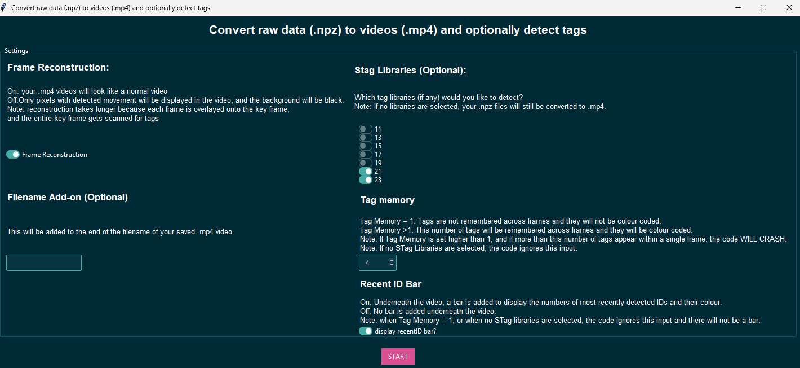

# STag-detector-post-recording
A lightweight Python tool for detection and tracking of STag markers on existing video files. It processes the videos and returns them with overlayed tag information.

This code keeps track of the n most recently detected tags and colour codes them. This means that even if a tag moves out of frame for a few seconds, it will still have the same colour when it returns.

  

### What are STags?
STags are a stable Fiducial Marker System, designed by [Burak Benligiray](https://github.com/bbenligiray/stag), used for motion tracking of animals.  

 ## Compatibility Notes
- [Installer](run_installer.sh) currently tested on **Windows**.
- Built in **Python**
- Uses the **STag** library by [Burak Benligiray](https://github.com/bbenligiray/stag)for marker detection
- Currently accepts .npz video formats acquired by the [SparseMotionCapture](https://github.com/JulianKempenaers/SparseMotionCapture?tab=readme-ov-file#sparsemotioncapture) recording software. Future upgrades plan to implement mp4 and avi compatibility. 

## Installation and Instructions
Instructions for first-time installation and use can be found [here](Installation_and_use_instructions.md).

### GUI
After running the installer, run the executable .sh file [(Run_Stag_Detection.sh)](Run_Stag_Detection.sh) to open the Graphical User Interface (GUI)

  

### Settings
These settings can be tweaked to improve STag detection. 

Setting | Options | Description 
:-- | :- | :-
STag Libraries | Multi-select: 17, 19, 21, 23 | This refers to the ['LibaryHD'](https://github.com/manfredstoiber/stag#-configuration:~:text=can%20be%20specified%3A-,libraryHD,-%3A) or 'Type' of STags that should be detected. Only the markers of the chosen library will be detected. When more than one library is selected, detected IDs will be displayed as a combination of the library and ID number. e.g. id 115 of Library 17 will be: 17115, 
How many recent tags? | Integer (1-21) | The code keeps track of this many tags. This code keeps track of the n most recently detected tags and colour codes them. This means that even if a tag moves out of frame for a few seconds, it will still have the same colour when it returns, unless n other tags have been detected since it moved out of frame. This variable enables changing how many other tags can be detected before this one is forgotten. If this is set to 1: No tags are detected, and there will be no colour coding. 
Video Filename Addon | Text (optional) | When selecting to save the tag detections video, this will be added on to the filename of your saved video file. 
Frame Reconstruction? | Yes/No toggle | Since the current version accepts sparse BSR_matrices as input, there is an option to reconstruct these back to full video frames, like [this](https://github.com/JulianKempenaers/SparseMotionCapture?tab=readme-ov-file#sparsemotioncapture:~:text=and%20fixed%20camera.-,NpzToMp4.py%3A,-Converts%20the%20compressed)
